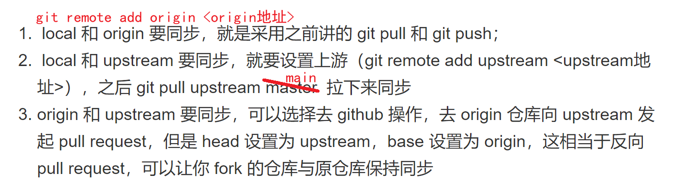
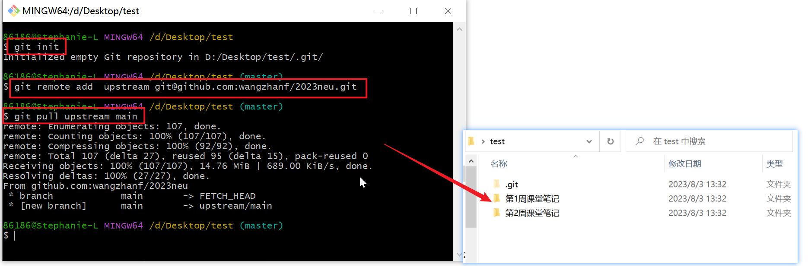

### git拉取别人GitHub文件

```
初始化： git init
远程连接：git remote add  upstream git@github.com:wangzhanf/2023neu.git
拉取：git pull upstream main
```








> 第一次Push的时候可以用：git push -u origin main
>
> 之后push更新就用：git push origin main


